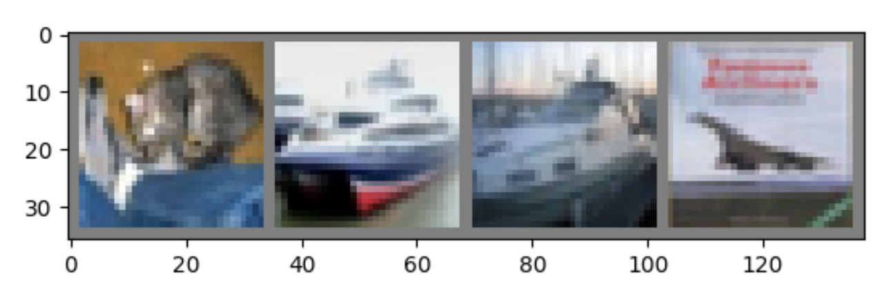

# Image Classification via CNN
This tutorial teaches you how to classify images in via convolutional neural network (CNN). You will learn how to create, train and evaluate a CNN by PyTorch.
- [CIFAR10 Dataset](#cifar10-dataset)
- [Create CNN Model](#create-cnn-model)
	- [Convolutional layers](#convolutional-layers)
	- [Activation](#activation)
	- [Pooling layers (subsampling)](#pooling-layers-subsampling)
	- [Fully connected (FC) layers](#fully-connected-fc-layers)
	- [Create LeNet-5](#create-lenet-5)
- [Train the model](#train-the-model)
- [Test the model](#test-the-model)
- [Assignment](#assignment)

Acknowledgement: part of this tutorial is adopted from [Deep Learning with PyTorch: A 60 Minute Blitz](https://pytorch.org/tutorials/beginner/blitz/cifar10_tutorial.html#sphx-glr-beginner-blitz-cifar10-tutorial-py).
## CIFAR10 Dataset
For this tutorial, we will use the CIFAR10 dataset. The CIFAR-10 dataset consists of 60000 32x32 colour images in 10 classes, with 6000 images per class. There are 50000 training images and 10000 test images. The images in CIFAR-10 are of size 3x32x32, i.e. 3-channel color images of 32x32 pixels in size. Note that PyTorch put channels at first dimension by convention. This is different from other platform such as Pillow, Matlab, skimage, etc. They all put channels at last dimension.

<center>

<p>Figure 1. CIFAR10 dataset</p>
</center>

We can load CIFAR10 from torchvision. It may take several minutes to download the dataset.
```python
from torchvision.datasets import CIFAR10
from torchvision.transforms import ToTensor

trainset = CIFAR10(root='./data', train=True,
                   download=True, transform=ToTensor())

testset = CIFAR10(root='./data', train=False,
                  download=True, transform=ToTensor())
```
The dataset consists of two part. One is train set, another one is test set. Usually, we train our model (CNN) on train set, and test the model on test set.

- Train: Show CNN the images, and tell it which class they belong to. In such a way, we can teach it to distinguish different classes.
- Test: Show CNN the images, and ask it which class they belong to. In such a way, we can test how well the CNN learns.

`trainset.classes` contains the all class names in order.
```python
trainset.classes
# ['airplane', 'automobile', 'bird', 'cat', 'deer', 'dog', 'frog', 'horse', 'ship', 'truck']
```
Train set contains 50000 images. Let's get the first image in train set, and show it.
```python
len(trainset)              # 50000 images
image, label = trainset[0] # get first image and its class id
image.shape                # 3 x 32 x 32
imshow(image)              # `imshow` is in cifar10.py
trainset.classes[label]    # 'frog'
```
You can see the image is of shape $3\times32\times32$, which means it has $3$ channels, and $32\times32$ pixels.

Script `cifar10.py` already contains all code you need to load the dataset. In your program, all you need to do is
```python
from dataset import trainset, testset, imshow
```
Beside the dataset itself, we also need `DataLoader` objects to help us randomly load image batch by batch. Batch means a small collection of images. Here, we set `batch_size` to 4, so each batch contains 4 images.

```python
trainloader = DataLoader(trainset, batch_size=4, shuffle=True)
testloader = DataLoader(testset, batch_size=4, shuffle=True)
```
Then we may iterate over the `DataLoader`, to get batches until the dataset is exhausted.
```python
for batch in trainloader:
    images, labels = batch
    print(images.shape) # [4, 3, 32, 32]
    print(labels.shape) # [4]
    break
```
`images` is of shape `[4, 3, 32, 32]`, which means it contains 4 images, each has 3 channels, and is of size 32x32. `labels` contains 4 scalars, which are the class IDs of this batch.

## Create CNN Model
In this tutorial, we implement a simple but famous CNN model, LeNet-5. 5 means it contains 5 (convolutional or fully-connected) layers.

<center>

<p>Figure 2. Architecture of LeNet-5</p>
</center>

A typical CNN consists of these kinds of layer --- convolutional layers, max pooling layers, and fully connected layers.

#### Convolutional layers
Convolutional layers are usually the first several layers. They perform a convolution on the output of last layer to extract features from the image. A convolutional layer has three architecture parameters:
- kernel_size $h\times w$: the size of the convolutional kernel.
- in_channels: the number of input channels
- out_channels: the number of output channels

The total number of trainable parameters in convolutional kernel is:
$$h\times w \times \text{in_channels}\times\text{out_channels}$$

The convolution is usually performed without padding, so image size will shrink after convolution. If input image size is $H\times W$ and the kernel size is $h\times w$, the output will be of size
$$(H+1-h) \times (W+1-w).$$
Then we take channels and batch size into consideration, assume the input tensor has shape [batch_size, in_channels, H, W], then the output tensor will have shape
- input shape: [batch_size, in_channels, H, W]
- output shape: [batch_size, out_channels, H+1-h, W+1-w]

#### Activation
The output of convolutional layer and fully connected layer is usually "activated", i.e., transformed by a non-linear function, such as ReLU, sigmoid, tanh, etc. Activation functions are all scalar function. They do not change the tensor shape, but only map each element into a new value. They usually contain no trainable parameters.

In this tutorial, we choose perhaps the most popular activation function, $ReLU(x) = \max(0, x)$.
<center>

<p>Figure 3. ReLU</p>
</center>
Here we demonstrate how to create the first convolutional layer of LeNet-5 by PyTorch. This layer has kernel size 5x5 and its output contains 6 channels. Its input is the original RGB images, so `in_channels=3`. The output is activated by ReLU (Original paper uses tanh).

```python
import torch.nn as nn
# convolutional layer 1
conv_layer1 = nn.Sequential(
    nn.Conv2d(in_channels=3, out_channels=6, kernel_size=(5,5)),
    nn.ReLU(),
)
```

#### Pooling layers (subsampling)
Pooling usually follows a convolutional layer. There are two kinds of pooling layer --- maximum pooling and average pooling. Maximum pooling computes the maximum of small local patches, while average pooling computes the average of small local patches.

<center>

<p> Figure 4. Max pooling with kernel size 2x2 </p>
</center>

The kernel size of a pooling layer is the size of local patches. Assume the input image is of size $H\times W$ and the kernel size is $h\times w$, the output of pooling layer will be of size
$$\frac{H}{h} \times \frac{W}{w}.$$
Then we take channels and batch size into consideration, input tensor and output tensor will have shape:
- input shape: [batch_size, in_channels, H, W],
- output shape: [batch_size, in_channels, H/h, W/w].

You may notice that pooling layers do not change the number of channels. Pooling layer does not contain any trainable parameters.

This example demonstrate how to create a 2x2 max pooling layer.
```python
max_pool = nn.MaxPool2d(kernel_size=(2,2))
```

#### Fully connected (FC) layers
Fully connected (FC) layers are usually the last several layers. They take the features conv layers produced and output the final classification result. Before go into FC layers, we need to "flatten" the intermediate representation produced by convolutional layers. The output of CNN is a 4D tensor of shape [batch_size, channels, H, W]. After flattened, it becomes a 2D tensor of shape [batch_size, channels\*H\*W].
This 2D tensor is exactly what FC layers consumes as input.
<center>
4D tensor of shape [batch_size, channels, H, W]

|<br/>
flatten<br/>
|<br/>
v<br/>
2D tensor of shape [batch_size, channels\*H\*W]
</center>

A FC layer has two architecture parameter --- input features and output features:
- in_features: the number of input features,
- out_features: the number of output features.


<center>

<p> Figure 5. FC layer with 7 input features and 5 output features</p>
</center>

The input and output of FC layers are of shape:
- input shape: [batch_size, in_features]
- output shape: [batch_size, out_features]

Because there is a weight between any input feature and any output feature, so the number of trainable parameters in a FC layer is
$$\text{in_features} \times \text{out_features}.$$

This example shows how to create a FC layer in PyTorch. The created FC layer has 120 input features and 84 output features, and its output is activated by ReLU.
```python
fc_layer = nn.Sequential(
    nn.Linear(in_features=120, out_features=84),
    nn.ReLU(),
)
```
The last layer of our CNN is a little bit special. First, it is not activated, i.e., no ReLU. Second, its output features must be equal to the number of classes. Here, we have 10 classes in total, so its output features must be 10.
```python
output_layer = nn.Linear(in_features=84, out_features=10)
```

#### Create LeNet-5
LeNet-5 is a simple but famous CNN model. It contains 5 (convolutional or fully-connected) layers. Here, we choose it as our CNN model. Its architecture is shown in figure 6.

<center>

<p>Figure 6. Architecture of LeNet-5</p>
</center>

The layers of LeNet-5 are summarized here:

0. Input image: 3x32x32
1. Conv layer:
    - kernel_size: 5x5
    - in_channels: 3
    - out_channels: 6
    - activation: ReLU
2. Max pooling:
    - kernel_size: 2x2
3. Conv layer:
    - kernel_size: 5x5
    - in_channels: 6
    - out_channels: 16
    - activation: ReLU
4. Max pooling:
    - kernel_size: 2x2
5. FC layer:
    - in_features: 16\*5\*5
    - out_features: 120
    - activation: ReLU
6. FC layer:
    - in_features: 120
    - out_features: 84
    - activation: ReLU
7. FC layer:
    - in_features: 84
    - out_features: 10 (number of classes)

`model.py` create LeNet-5 by PyTorch. First, we create the 2 convolutional layers:
```python
import torch.nn as nn

# convolutional layer 1
conv_layer1 = nn.Sequential(
    nn.Conv2d(in_channels=3, out_channels=6, kernel_size=(5,5)),
    nn.ReLU()),
)
# convolutional layer 2
conv_layer2 = nn.Sequential(
    nn.Conv2d(in_channels=6, out_channels=16, kernel_size=(5,5)),
    nn.ReLU()),
)
```
Then, the 3 fully connected layers:
```python
# fully connected layer 1
fc_layer1 = nn.Sequential(
    nn.Linear(in_features=16*5*5, out_features=120),
    nn.ReLU(),
)
# fully connected layer 2
fc_layer2 = nn.Sequential(
    nn.Linear(in_features=120, out_features=84),
    nn.ReLU(),
)
# fully connected layer 3
fc_layer3 = nn.Linear(in_features=84, out_features=10)
```
Finally, combine them as LeNet-5. Don't forget flatten layer before FC layers.
```python
LeNet5 = nn.Sequential(
    conv_layer1,
    nn.MaxPool2d(kernel_size=(2,2)),
    conv_layer2,
    nn.MaxPool2d(kernel_size=(2,2)),
    nn.Flatten(), # flatten
    fc_layer1,
    fc_layer2,
    fc_layer3
)
```

## Train the model
After create the network, we will teach it how to distinguish images between different classes. Intuitively, the teaching is achieved by showing it the images in train set, and telling it which classes they belong to. The network will gradually learn the concepts, such as 'bird', 'cat', 'dog', etc., just like how human children learn. This part of code is in `train.py`.

First, we import our model `LeNet5`, and define the loss function and optimization method. Here, we use cross-entropy loss, which is designed for classification tasks. This loss measure how similar your prediction is to the correct answer (ground truth). The closer your prediction is to the correct one, the smaller this loss is. To minimize this loss, we need an optimizer. Here, we use stochastic gradient descent (SGD) method as optimizer.

```python
from model import LeNet5
model = LeNet5

loss_fn = nn.CrossEntropyLoss()
optimizer = optim.SGD(model.parameters(), lr=0.001, momentum=0.9)
```
When training a network, the most important parameter is learning rate. In above example, learning rate `lr` is 0.001. To train model successfully, you need a proper learning rate. If learning rate is too small, your loss will converge very slowly. If learning rate is too big, loss may not converge at all.

Then we start training. The training usually takes minutes to hours. Once you finish looping over the dataset one time, you finished one epoch. A successful train usually has multiple epochs. Following example trains the network for 2 epochs.

```python
# training
num_epoch = 2
for epoch in range(num_epoch):  
    running_loss = 0.0
    for i, data in enumerate(trainloader, 0):
        # get the images; data is a list of [images, labels]
        images, labels = data

        optimizer.zero_grad() # zero the parameter gradients

        # get prediction
        outputs = model(images)

        # compute loss
        loss = loss_fn(outputs, labels)

        # reduce loss
        loss.backward()
        optimizer.step()

        # print statistics
        running_loss += loss.item()
        if i % 500 == 499:  # print every 500 mini-batches
            print('[%d, %5d] loss: %.3f' %
                  (epoch + 1, i + 1, running_loss / 500))
            running_loss = 0.0

print('Finished Training')
```

## Test the model
After training, our model can classify images now. At first, we show it several images in test set to see if it can correctly recognize them.
```python
dataiter = iter(testloader)
images, labels = dataiter.next()
predictions = model(images).argmax(1)

# show some prediction result
print('GroundTruth: ', ' '.join('%5s' % classes[labels[j]] for j in range(4)))
print('Prediction: ', ' '.join('%5s' % classes[predictions[j]] for j in range(4)))
# imshow(torchvision.utils.make_grid(images))
```

You will see images and output like this. Due to randomness, your results may be different.
<center>

</center>

```
GroundTruth:    cat  ship  ship plane
Prediction:    cat  ship plane plane
```

Next, let us look at how the model performs on the whole dataset.
```python
def accuracy(model, data_loader):
    correct, total = 0, 0
    with torch.no_grad():
        for batch in data_loader:
            images, labels = batch
            images, labels = images.to(device), labels.to(device)
            outputs = model(images)
            _, predicted = torch.max(outputs.data, 1)
            total += labels.size(0)
            correct += (predicted == labels).sum().item()
    return correct / total


train_acc = accuracy(model, trainloader) # accuracy on train set
test_acc = accuracy(model, testloader)  # accuracy on test set

print('Accuracy on the train set: %f %%' % (100 * train_acc))
print('Accuracy on the test set: %f %%' % (100 * test_acc))
```
The output looks like
```
Accuracy on the train set: 62.34 %
Accuracy on the test set: 57.23 %
```
Since we trained for only 2 epochs, the accuracy is not very high.

Finally, we can save our model to a file:
```python
torch.save(LeNet5.state_dict(), 'model.pth')
```

# Assignment
Modify `train.py`, `dataset.py` and `model.py` to train a CNN to recognize hand-written digits in MNIST datasets.

<center>

<p>Figure 7. Example images from MNIST</p>
</center>

MNIST contains images of digits 0-9 written by human. The task is to recognize which digit the image represent. All image are grey scale (only 1 channel), and contains 28x28 pixels.

Your CNN should contain following layers in order.

0. Input image: 1x28x28
1. Conv layer:
    - kernel_size: 5x5
    - out_channels: 16
    - activation: ReLU
2. Max pooling:
    - kernel_size: 2x2
3. Conv layer:
    - kernel_size: 3x3
    - out_channels: 32
    - activation: ReLU
4. Max pooling:
    - kernel_size: 2x2
5. Conv layer:
    - kernel_size: 1x1
    - out_channels: 8
    - activation: ReLU
6. FC layer:
    - out_features: 64
    - activation: ReLU
7. FC layer:
    - out_features: ?? (to be inferred by you)
    - activation: None

Tasks:

1. Answer following questions first (7 points):
    - Assume we set `batch_size=8`, what shape do above 7 layers' inputs and outputs have?
    - How many trainable parameters each layer contains?
2. Train a CNN to recognize hand-written digits in MNIST datasets.
    - Modify `model.py` to create a CNN with architecture specified above. (7 points)
    - Modify `train.py` and `dataset.py` to train it on MNIST dataset. Your model should achieve an accuracy higher than 90% on test set. Usually, 5-10 epochs are enough to achieve this accuracy. Save your model to file `model.pth`. (6 points)

Your submission should include:
1. An report, containing
    - your answer to above questions
    - screenshot and explanation of your program output.
2. All python source file.
3. `model.pth`, the saved model.

Please submit before __23:59 on December 20th (Sunday)__. You may submit as many times as you want, but only your latest submission will be graded.
